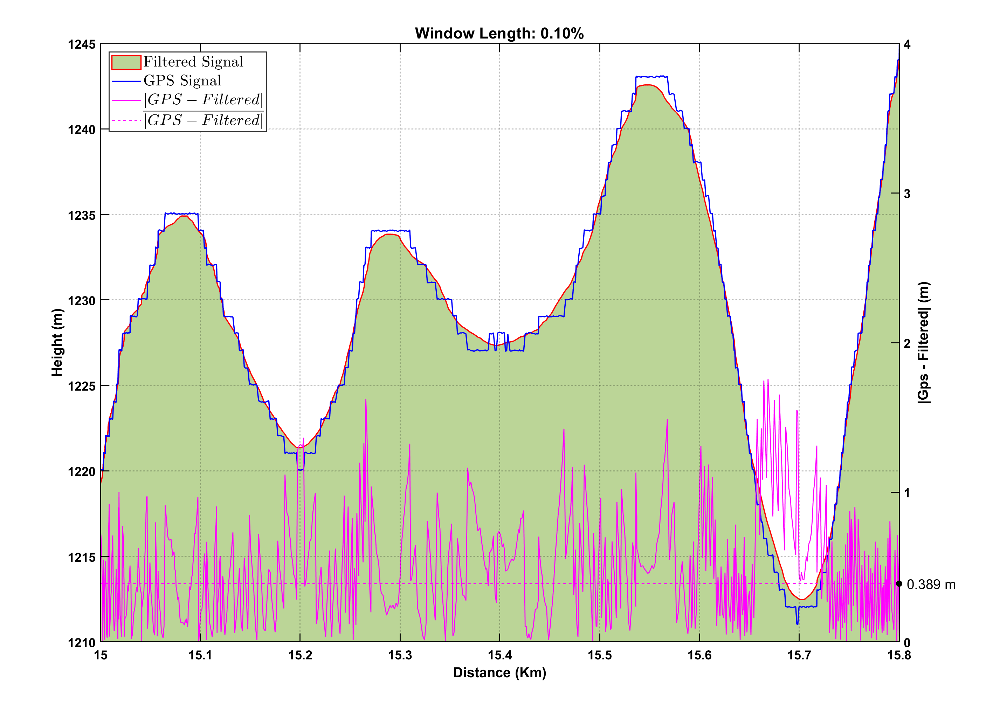
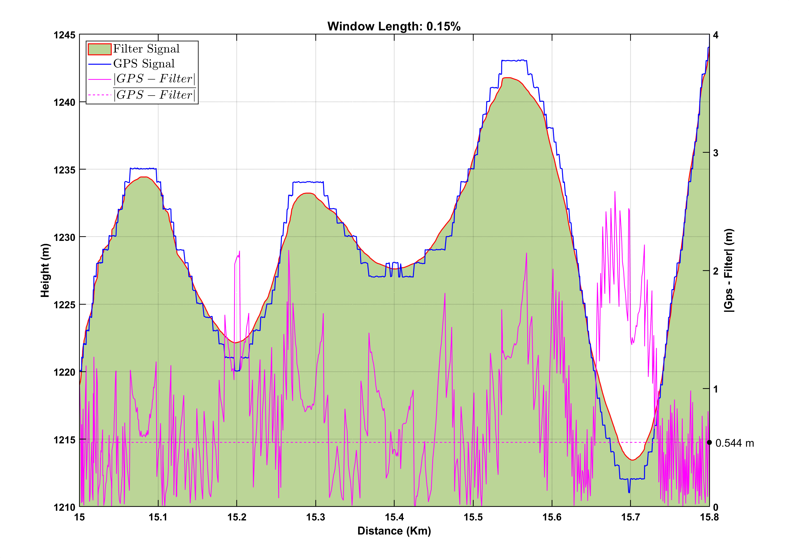
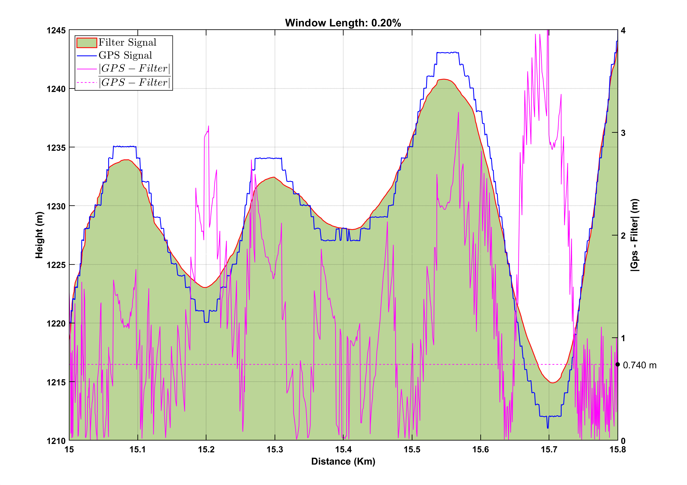
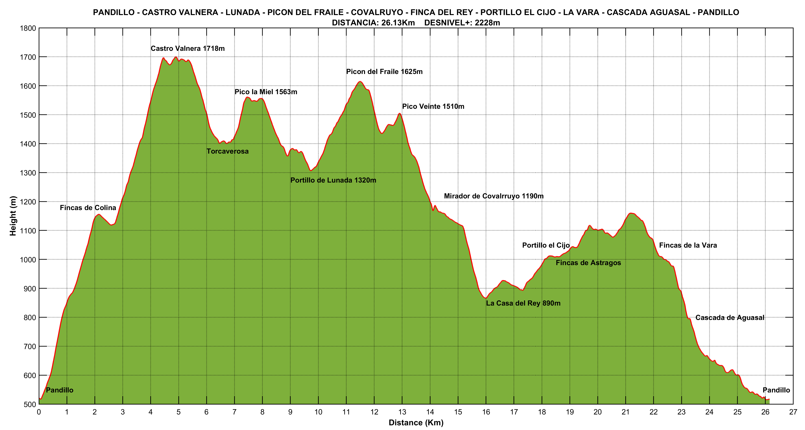
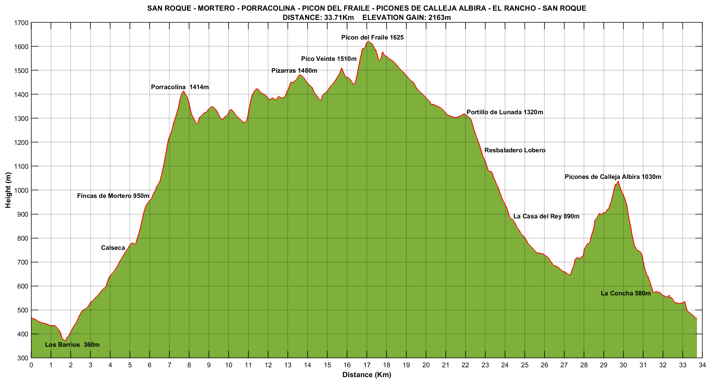
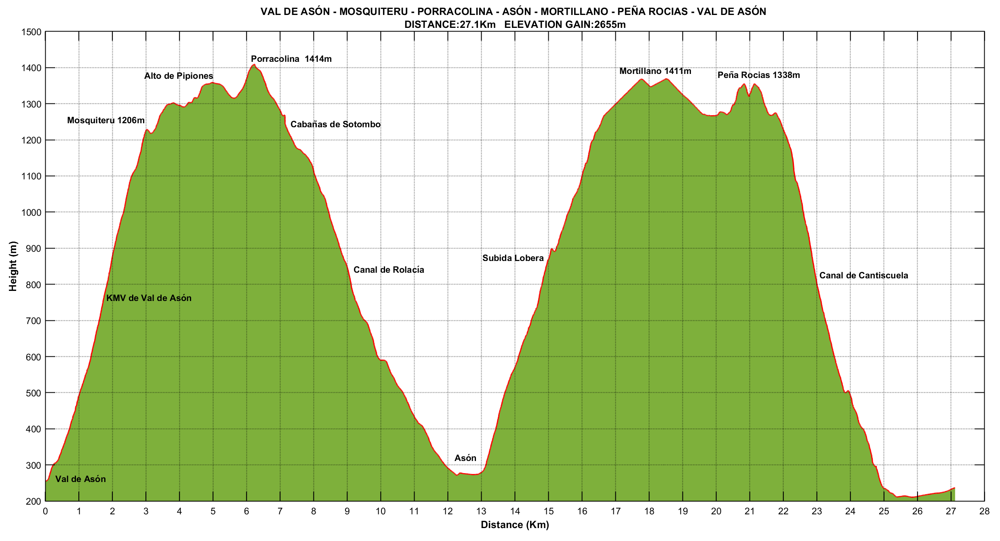
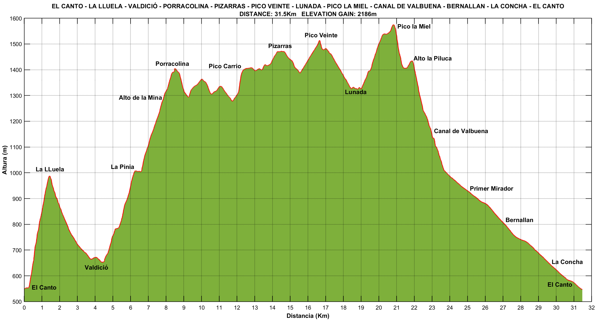

# Elevation Profile

With this script you can represent and customize altitude profiles from .gpx files using Matlab. To smooth the profile, the [Moving mean](https://es.mathworks.com/help/matlab/ref/movmean.html) function is used. It's important to select the length of the moving mean window based on the GPS signal quality through the **window_percent** parameter. This parameter represents the window length as a percentage of the total number of GPS samples.

Some examples to compare the effect of varying the parameter **window_percent**:

 

 

$$
\overline{|GPS-Filtered|} = 0.271 m
$$

  

$$
\overline{|GPS-Filtered|} = 0.389m
$$

  

$$
\overline{|GPS-Filtered|} = 0.544 m
$$

  

$$
\overline{|GPS-Filtered|} = 0.740 m
$$

  

# Elevation profiles final examples from my wikiloc routes

https://es.wikiloc.com/rutas-senderismo/selaya-picones-de-sopena-castro-valnera-bajada-a-vega-de-pas-desde-el-alto-de-estacas-de-trueba-sel-57011719

 

https://es.wikiloc.com/rutas-senderismo/pandillo-castrovalnera-lunada-picondelfraile-covalrruyo-fincadelrey-portilloelcijo-lavara-cascadade-73922005

 

https://es.wikiloc.com/rutas-senderismo/sanroque-porracolina-picondelfraile-piconesdecallejaalbira-sanroque-69089035

 

https://es.wikiloc.com/rutas-senderismo/valdeason-mosquiteru-porracolina-ason-mortillano-penarocias-valdeason-72540252

 

https://es.wikiloc.com/rutas-senderismo/el-canto-la-lluela-valdicio-porracolina-pizarras-pico-veinte-lunada-pico-la-miel-canal-de-valbuena-120774650

