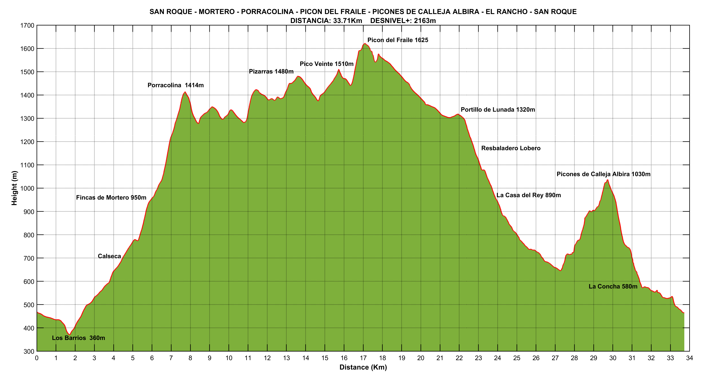

# Elevation Profile

With this script you can represent and customize altitude profiles from .gpx files using Matlab. 

# Elevation profiles examples

https://es.wikiloc.com/rutas-senderismo/pandillo-castrovalnera-lunada-picondelfraile-covalrruyo-fincadelrey-portilloelcijo-lavara-cascadade-73922005

https://es.wikiloc.com/rutas-senderismo/sanroque-porracolina-picondelfraile-piconesdecallejaalbira-sanroque-69089035

